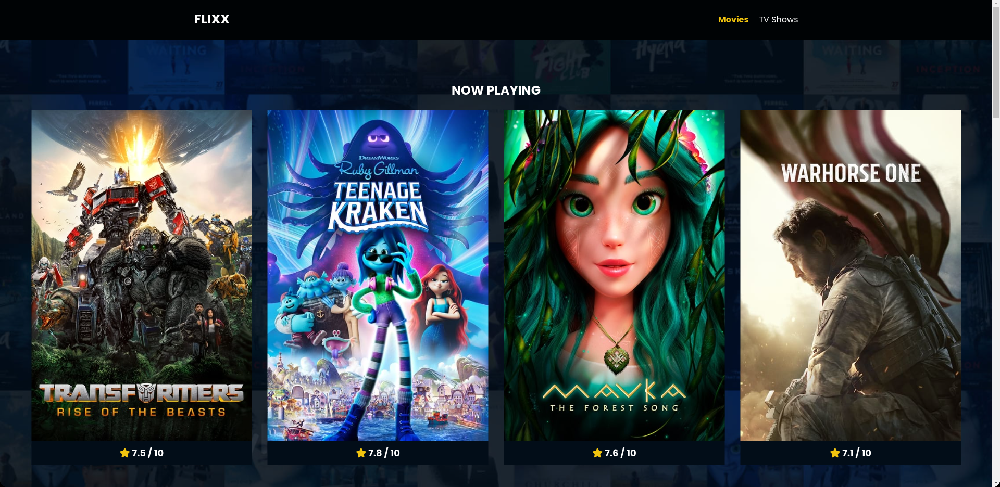
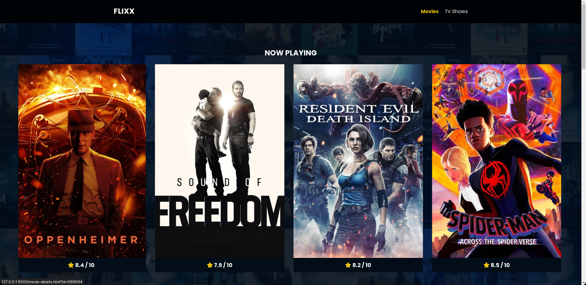
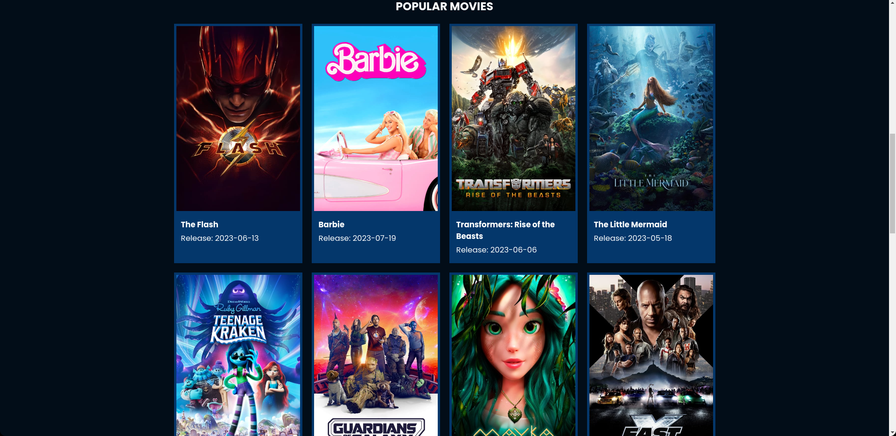
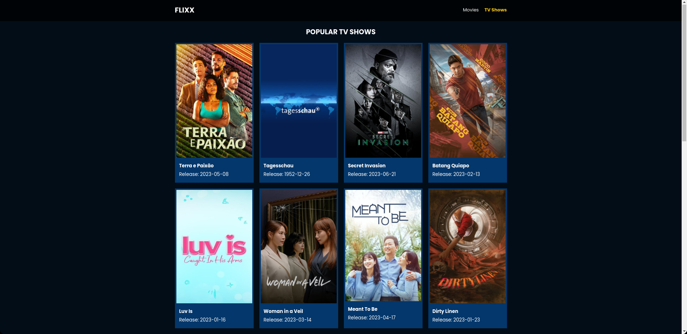
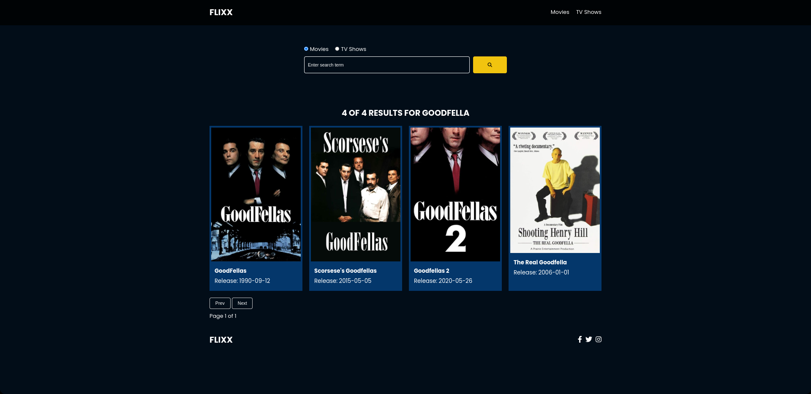
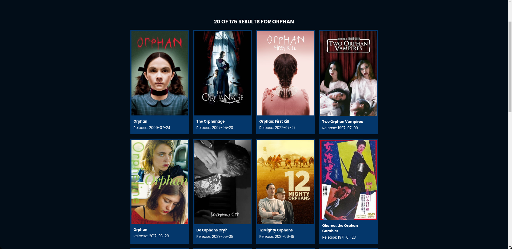
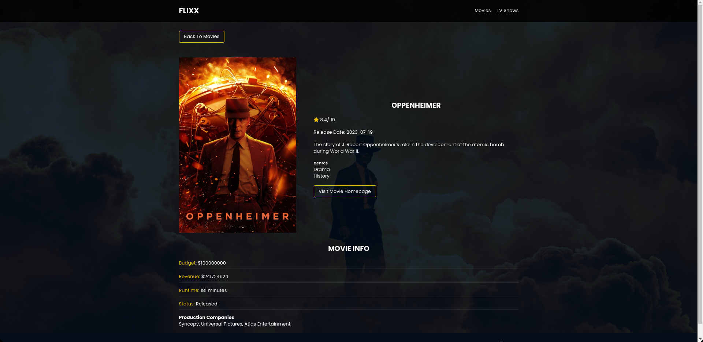
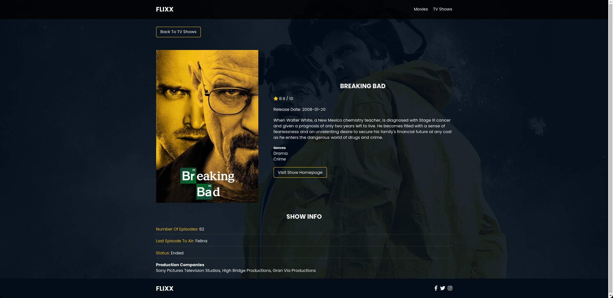

# Flixx App

Movie and TV show info application built with vanilla JavaScript that uses **version 3** of the [TMDB API](https://developers.themoviedb.org/3)

## API

**[TMDB API](https://developers.themoviedb.org/3)** is a free public API. The Movie Database (TMDB) is where you will find the definitive list of currently available methods for movie, tv, actor and image.

## Features

This includes the most popular movies and TV shows with detail pages, a search box for movies and shows with full pagination and a slider for movies that are currently playing in theaters. The slider uses the [Swiper](https://swiperjs.com/) library.

# Screenshots

    
    
    
    
    
    
    
    

